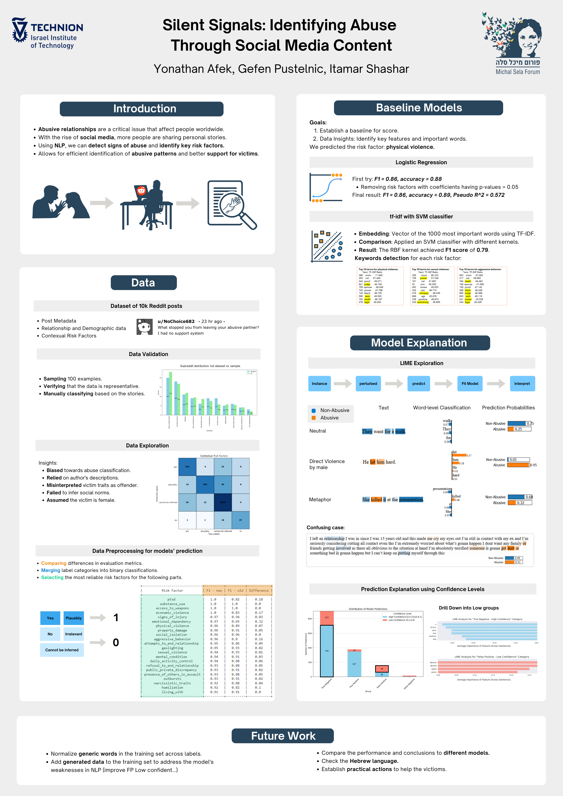

# 🌟 Silent Signals: Identifying Abuse Through Social Media Content

## 📝 Overview
This project leverages **Natural Language Processing (NLP)** to identify signs of abusive relationships using social media content. By analyzing posts and comments, we aimed to detect **risk factors** and classify instances of abuse to support victims effectively.

The project includes:
- A **Jupyter Notebook** with the code and results.
- A **visual poster** summarizing the key findings and methodology.

---

## 🖼️ Project Poster

The poster highlights:
- Goals and methodology.
- Baseline models used for classification.
- Insights from data exploration and preprocessing.
- Model explanations using **LIME** and confidence levels.
- Recommendations for future work.

---

## 📂 Files
1. `Poster.png`: A visual summary of the project.
2. `NLP_Abusive_Relationship.pdf`: Pre-rendered version of the notebook for easy viewing.
